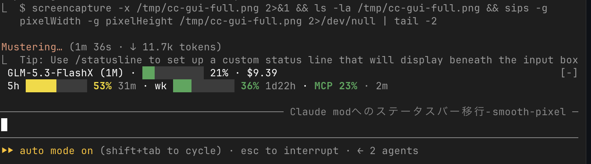
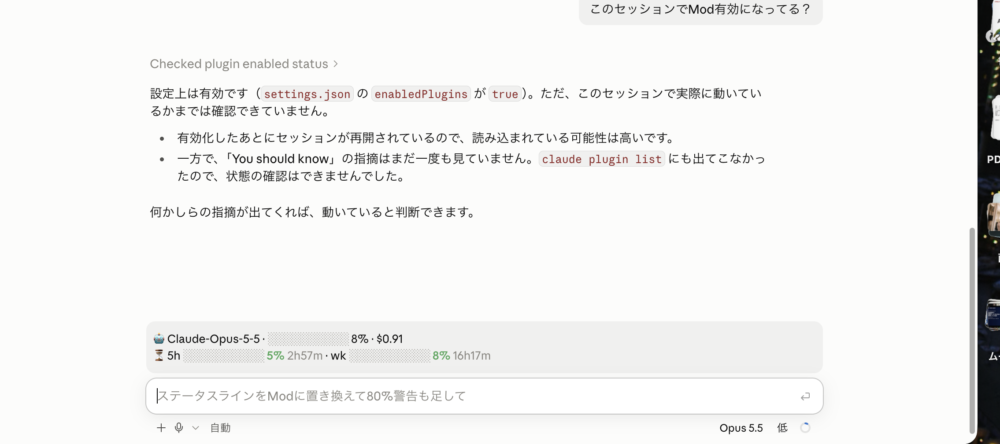

<p align="center">
  
</p>

<p align="center">
  <a href="https://github.com/evggzzz/cc-contextbar/releases"></a>
  <a href="https://github.com/evggzzz/cc-contextbar/actions/workflows/ci.yml"></a>
  
  
  
  
  
</p>

<p align="center">
  A battery-style <strong>context-window statusline</strong> for <a href="https://code.claude.com">Claude Code</a>.<br>
  Fast, dependency-light — and it actually works with <strong>non-Anthropic models</strong> (GLM, etc.).
</p>

<p align="center">
  <sub><a href="README.md">English</a> · <a href="README.zh-CN.md">简体中文</a> · <a href="README.ja.md">日本語</a></sub>
</p>

<p align="center">
  
</p>

---

## ✨ Features

| | |
|---|---|
| 🎛️ **Band mod** | Since 1.1.0: a **live band above the prompt** — terminal and desktop Code tab, no `statusLine` entry needed. Since 1.2.0 the quota line is **surface-aware**: z.ai quota in the terminal, Claude-plan rate limits on the desktop. |
| 🔋 **Battery bar** | `[██████░░░░]` fills up; green → yellow → red as your context fills. |
| 🧠 **Any model** | GLM and other proxy-backed models report `used_percentage = 0`. cc-contextbar reads the transcript and computes **real** usage. |
| ⚡ **Fast** | Pure `bash` + `jq`, ~30 ms per render. No Node, no process pile-up. |
| 💸 **Real cost** | Cumulative tokens × rates. **Auto-detects** pricing by model (GLM, DeepSeek, Qwen, Kimi, Claude, GPT); override in one file. |
| 🛠️ **Zero config** | Works out of the box — auto-pricing needs no setup. |
| 🧩 **Plugin or curl** | Install as a Claude Code plugin or via a one-line script. |

## 🚀 Quick start

**Option A — band mod (recommended)**

```bash
claude plugin marketplace add evggzzz/cc-contextbar
claude plugin install cc-contextbar@cc-contextbar
```

**Restart Claude Code.** A live **band above the prompt** then shows your context % and session cost. The quota line follows where you are: in the terminal it reads your **z.ai quota** (5h / weekly / MCP, from the [cc-zaiquota](https://github.com/evggzzz/cc-zaiquota) daemon's cache); in the desktop Code tab it shows your **Claude plan's rate-limit windows** straight from the API. No `jq`, no `statusLine` entry.

**Option B — classic statusline**

Install as in Option A, then run `/cc-contextbar:install` inside Claude Code — or just use the one-liner:

```bash
curl -fsSL https://raw.githubusercontent.com/evggzzz/cc-contextbar/main/scripts/install.sh | bash
```

Both copy `statusline.sh` to `~/.claude/ctxbar/`, create a `pricing.env`, and wire the `statusLine` entry into `~/.claude/settings.json` (a `.bak` backup is written first). Requires [`jq`](https://stedolan.github.io/jq/) — `brew install jq` / `apt install jq`. **Restart Claude Code** when done.

> ⚠️ **Pick one.** The band and the `statusLine` show the same information — installing both renders it twice.

## 📸 The band

**Terminal** (macOS) — the band sits right above the input box; line 2 is your z.ai quota, read from the cc-zaiquota daemon's cache:



**Desktop Code tab** — the band sits above the chat input; line 2 is your Claude plan's own rate-limit windows, as the API reported them:



| Surface | Line 2 source |
|---|---|
| terminal | z.ai quota — cc-zaiquota daemon's `quota.cache` (5h / weekly / MCP, zero network) |
| desktop / vscode / mobile | the API's rate-limit windows (`five_hour` / `seven_day`); falls back to the cache when the plan reports none |

## ⚙️ Pricing

Pricing is **auto-detected** from the model name (GLM, DeepSeek, Qwen, Kimi, Claude, GPT) — no setup needed. The auto rates are estimates; to use exact rates, create `~/.claude/ctxbar/pricing.env` (per 1,000,000 tokens):

```bash
PRICE_INPUT=1.00        # regular input + cache creation
PRICE_CACHE_READ=0.10   # cache read (cheaper)
PRICE_OUTPUT=4.00       # output
CUR='$'                 # currency symbol ($, ¥, €, …)

# optional appearance
# CTXBAR_SEGMENTS=10    # bar cell count
# CTXBAR_FILL=█         # filled glyph
# CTXBAR_EMPTY=░        # empty glyph
```

If `pricing.env` exists, it always wins (auto-detection is disabled). For unknown models without `pricing.env`, cost shows `--`.

## 🤔 Why does this exist?

> [!IMPORTANT]
> Claude Code's native statusline fields report **`context_window.used_percentage = 0`** for non-Anthropic models (GLM, and anything behind a proxy). So the built-in context meter is useless exactly when you're not on Anthropic — cc-contextbar fixes that by reading the **transcript** directly.

It also replaces heavier Node-based statusline tools that spawn a ~2 s process on every render and pile up dozens of `node` processes. This is `bash` + `jq` — ~30 ms.

## 🔬 How it works

- The statusline receives Claude Code's JSON on stdin. We read `model.display_name` and `context_window.context_window_size`.
- **Context %** = last assistant message's `input + cache_creation + cache_read` tokens ÷ context window size.
- **Cost** = Σ across the session of those token buckets × your rates.
- Color thresholds: `< 50%` green · `< 80%` yellow · `≥ 80%` red.

## 📊 Comparison

| | Native `/context` | `ccusage statusline` | **cc-contextbar** |
|---|:--:|:--:|:--:|
| Non-Anthropic models | ❌ shows 0 | ✅ | ✅ |
| Always-on statusline | ❌ on-demand | ✅ | ✅ |
| Cost from custom pricing | ❌ | ⚠️ own rates | ✅ |
| Startup speed | — | ~2 s (Node) | **~30 ms (bash)** |
| Process pile-up | — | ⚠️ common | ✅ none |

## 🗑️ Uninstall

```bash
curl -fsSL https://raw.githubusercontent.com/evggzzz/cc-contextbar/main/scripts/install.sh | bash -s -- --uninstall
```

Removes the `statusLine` entry from `settings.json` (with backup) and deletes `~/.claude/ctxbar/`.

## ⭐ Star History

<a href="https://star-history.com/#evggzzz/cc-contextbar&Date">
  
</a>

## 📄 License

MIT © [evggzzz](https://github.com/evggzzz)
