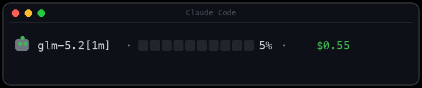

<p align="center">
  
</p>

<p align="center">
  <a href="https://github.com/evggzzz/cc-contextbar/releases"></a>
  <a href="https://github.com/evggzzz/cc-contextbar/actions/workflows/ci.yml"></a>
  
  
  
  
  
</p>

<p align="center">
  为 <a href="https://code.claude.com">Claude Code</a> 打造的<strong>电池式上下文窗口状态栏</strong>。<br>
  轻量、快速 —— 并且<strong>真正支持非 Anthropic 模型</strong>（GLM 等）。
</p>

<p align="center">
  <sub><a href="README.md">English</a> · <a href="README.zh-CN.md">简体中文</a> · <a href="README.ja.md">日本語</a></sub>
</p>

<p align="center">
  
</p>

---

## ✨ 特性

| | |
|---|---|
| 🔋 **电池进度条** | `[██████░░░░]` 随上下文填充而增长；绿 → 黄 → 红。 |
| 🧠 **任意模型** | GLM 等代理模型的原生 `used_percentage` 恒为 0。cc-contextbar 直接读取会话记录，计算**真实**用量。 |
| ⚡ **极速** | 纯 `bash` + `jq`，每次渲染约 30 ms。无 Node，无进程堆积。 |
| 💸 **真实成本** | 按累计 token × 单价计算。**按模型自动识别**价格（GLM、DeepSeek、Qwen、Kimi、Claude、GPT），也可在一个文件里覆盖。 |
| 🛠️ **零配置** | 开箱即用 —— 自动计价无需任何设置。 |
| 🧩 **插件或脚本** | 可作为 Claude Code 插件安装，或用一行命令安装。 |

## 🚀 快速开始

> 需要 [`jq`](https://stedolan.github.io/jq/) —— `brew install jq` / `apt install jq`。

**方式 A —— 作为插件**

```bash
claude plugin marketplace add evggzzz/cc-contextbar
claude plugin install cc-contextbar@cc-contextbar
```

然后在 Claude Code 中执行：

```
/cc-contextbar:install
```

**方式 B —— 一行命令**

```bash
curl -fsSL https://raw.githubusercontent.com/evggzzz/cc-contextbar/main/scripts/install.sh | bash
```

两种方式都会把 `statusline.sh` 拷贝到 `~/.claude/ctxbar/`，生成 `pricing.env`，并把 `statusLine` 写入 `~/.claude/settings.json`（会先备份为 `.bak`）。完成后**重启 Claude Code**。

## ⚙️ 计价

价格会**按模型名自动识别**（GLM、DeepSeek、Qwen、Kimi、Claude、GPT）—— 无需设置。自动价格为估算值；若要使用精确价格，创建 `~/.claude/ctxbar/pricing.env`（单位：每 1,000,000 token）：

```bash
PRICE_INPUT=1.00        # 常规输入 + 缓存写入
PRICE_CACHE_READ=0.10   # 缓存读取（更便宜）
PRICE_OUTPUT=4.00       # 输出
CUR='$'                 # 货币符号（$、¥、€ 等）

# 可选外观
# CTXBAR_SEGMENTS=10    # 进度条格子数
# CTXBAR_FILL=█         # 已填充字符
# CTXBAR_EMPTY=░        # 未填充字符
```

若 `pricing.env` 存在，则始终优先使用（自动识别将被禁用）。对未识别模型且无 `pricing.env` 时，成本显示为 `--`。

## 🤔 为什么会有这个项目？

> [!IMPORTANT]
> Claude Code 原生状态栏字段对非 Anthropic 模型（GLM，以及任何走代理的模型）报告的 **`context_window.used_percentage` 恒为 0**。也就是说，原生上下文计量器恰恰在你不用 Anthropic 时失效 —— cc-contextbar 通过直接读取**会话记录**来解决。

它也替代了那些每次渲染都启动约 2 秒 Node 进程、堆积几十个 `node` 进程的笨重状态栏工具。这里只有 `bash` + `jq` —— 约 30 ms。

## 🔬 工作原理

- 状态栏通过 stdin 接收 Claude Code 的 JSON。我们读取 `model.display_name` 与 `context_window.context_window_size`。
- **上下文占比** = 最近一条 assistant 消息的 `input + cache_creation + cache_read` token ÷ 上下文窗口大小。
- **成本** = 会话全程这些 token 桶的累加 × 单价。
- 颜色阈值：`< 50%` 绿 · `< 80%` 黄 · `≥ 80%` 红。

## 📊 对比

| | 原生 `/context` | `ccusage statusline` | **cc-contextbar** |
|---|:--:|:--:|:--:|
| 非Anthropic模型 | ❌ 显示0 | ✅ | ✅ |
| 常驻状态栏 | ❌ 按需 | ✅ | ✅ |
| 按自定义价格算成本 | ❌ | ⚠️ 自带费率 | ✅ |
| 启动速度 | — | ~2 s (Node) | **~30 ms (bash)** |
| 进程堆积 | — | ⚠️ 常见 | ✅ 无 |

## 🗑️ 卸载

```bash
curl -fsSL https://raw.githubusercontent.com/evggzzz/cc-contextbar/main/scripts/install.sh | bash -s -- --uninstall
```

会从 `settings.json` 移除 `statusLine` 条目（含备份）并删除 `~/.claude/ctxbar/`。

## ⭐ Star 历史

<a href="https://star-history.com/#evggzzz/cc-contextbar&Date">
  
</a>

## 📄 许可证

MIT © [evggzzz](https://github.com/evggzzz)
